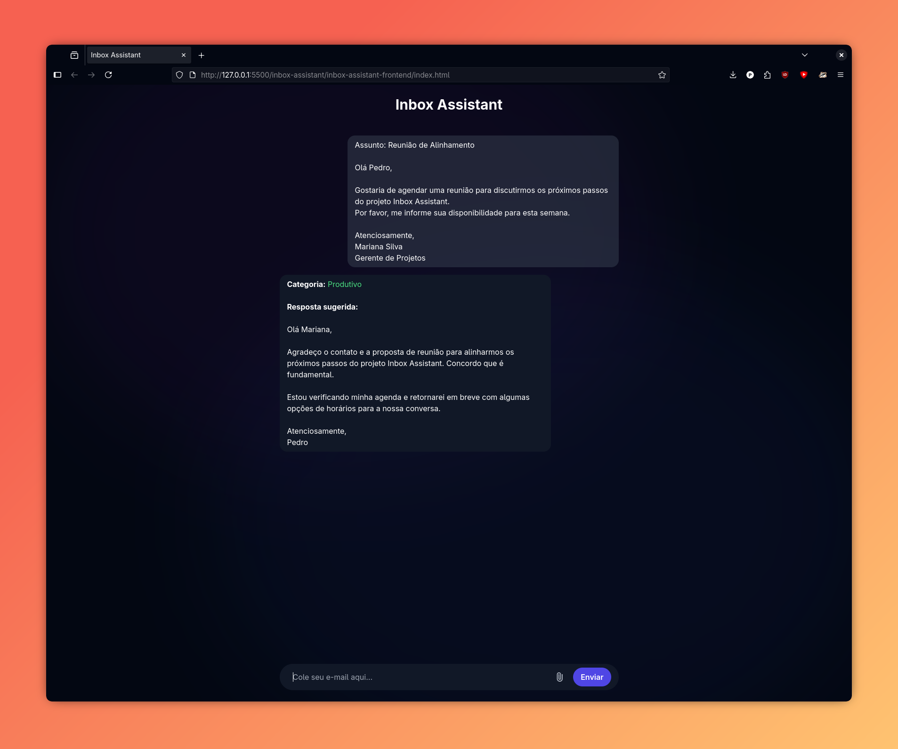

# Inbox Assistant

O **Inbox Assistant** é uma aplicação web que utiliza **Inteligência Artificial** para classificar e-mails e sugerir respostas automáticas.  
A proposta é reduzir tempo gasto com mensagens irrelevantes, ajudando o usuário a se concentrar apenas no que é importante.

---




> Observação: Como o projeto depende das APIs do Google, verifique se estão operacionais antes de usar: [Google AI Studio Status](https://aistudio.google.com/status)

## Como funciona

- O backend é desenvolvido em **FastAPI (Python)**.
- O texto dos e-mails é processado com **técnicas de NLP (Processamento de Linguagem Natural)**.
- A classificação e a sugestão de resposta fazem uso da **IA do Google**, consumida via API.
- O frontend é feito em **HTML, TailwindCSS e JavaScript**, com interface simples e responsiva.

---

## Funcionalidades

- Entrada manual de texto diretamente na interface.
- Upload de arquivos **.txt** ou **.pdf** contendo e-mails.
- Classificação automática em **Produtivo** ou **Improdutivo**.
- Sugestão de resposta gerada pela IA.
- Interface em formato de chat, intuitiva e leve.

---

## Executando localmente

### Backend

1. Clone o repositório e entre na pasta:

   ```bash
   git clone https://github.com/seu-usuario/inbox-assistant.git
   cd inbox-assistant/backend

   ```

2. Crie um ambiente virtual e ative:

   ```bash
   python -m venv venv
   source venv/bin/activate   # Linux/Mac
   venv\Scripts\activate      # Windows

   ```

3. Instale as dependências:

   ```bash
   pip install -r requirements.txt

   ```

4. Crie o arquivo `.env` em `inbox-assistant-backend/app` com sua key para a Google API

   ```
   GEMINI_API_KEY=api_key_here
   ```

5. Execute o servidor:
   ```bash
   uvicorn main:app --reload
   ```

O backend estará disponível em http://127.0.0.1:8000.

### Frontend

1. Entre na pasta frontend e abra o arquivo index.html no navegador.

2. Certifique-se de que o backend esteja rodando antes de enviar mensagens.

## Estrutura do Projeto

```bash
inbox-assistant/
│
├── backend/        # FastAPI + NLP + IA do Google
│   ├── main.py
│   └── requirements.txt
│
├── frontend/       # HTML, Tailwind, JS
│   └── index.html
│
└── README.md
```
